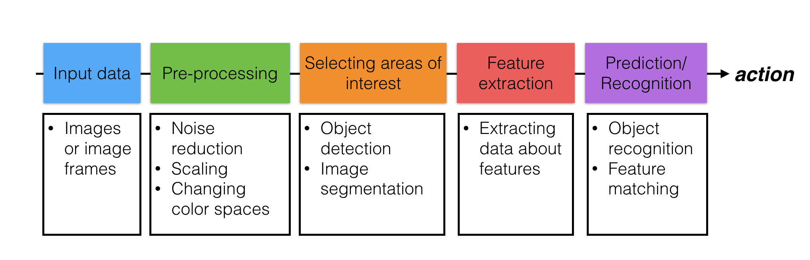

# Test opencv2

This knowledge is the foundation of any computer vision application.

First, we learned about treating images as functions so that we could perform operations on pixel values and locations to transform the image! We used that knowledge to transform the color and geometry of images and to filter our images to enhance the most important information. We focused on learning how to implement one BIG step of the computer vision pipeline: Pre-processing!

Next, we'll see how this all fits together with the rest of the pipeline and move on to learning about and Selecting Areas of Interest using image segmentation techniques. Then we'll move on to more complex computer vision topics and object recognition!

### Computer Vision Pipeline

